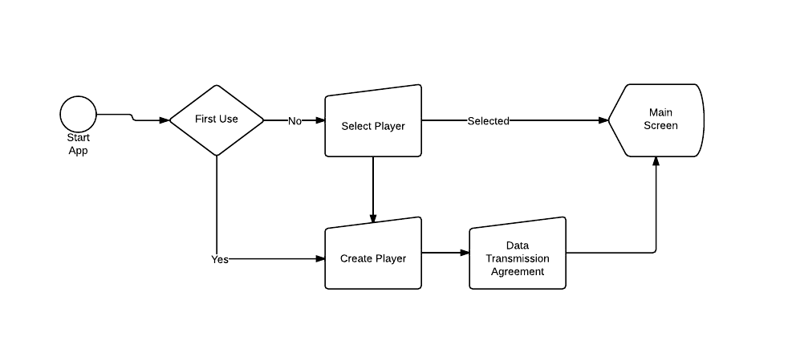
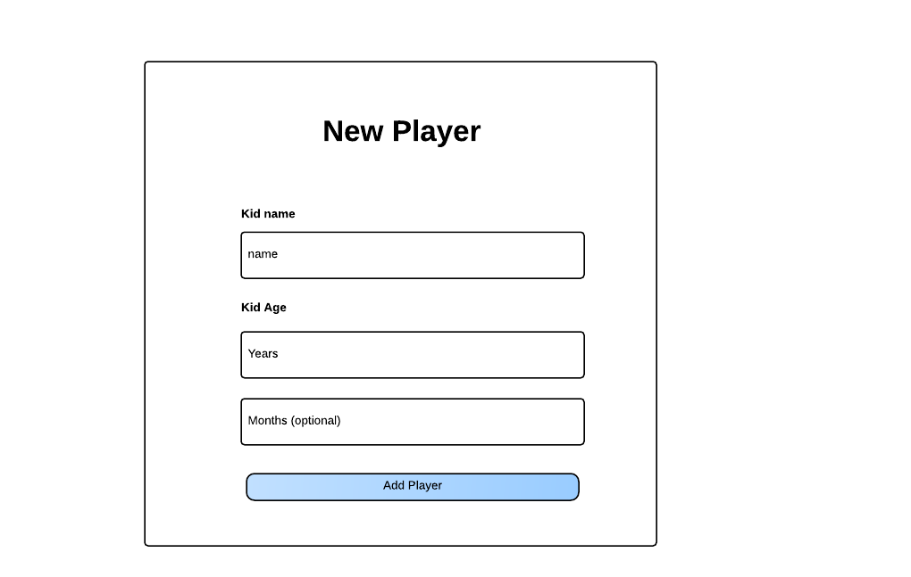
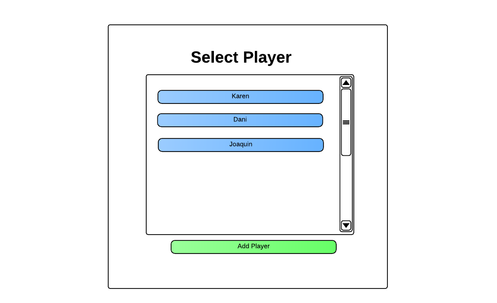
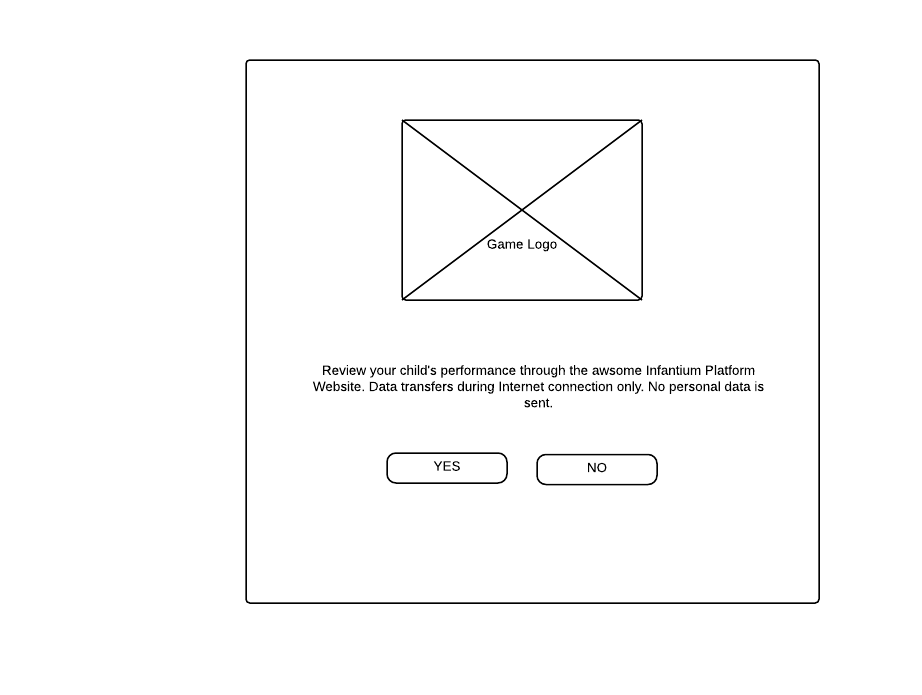
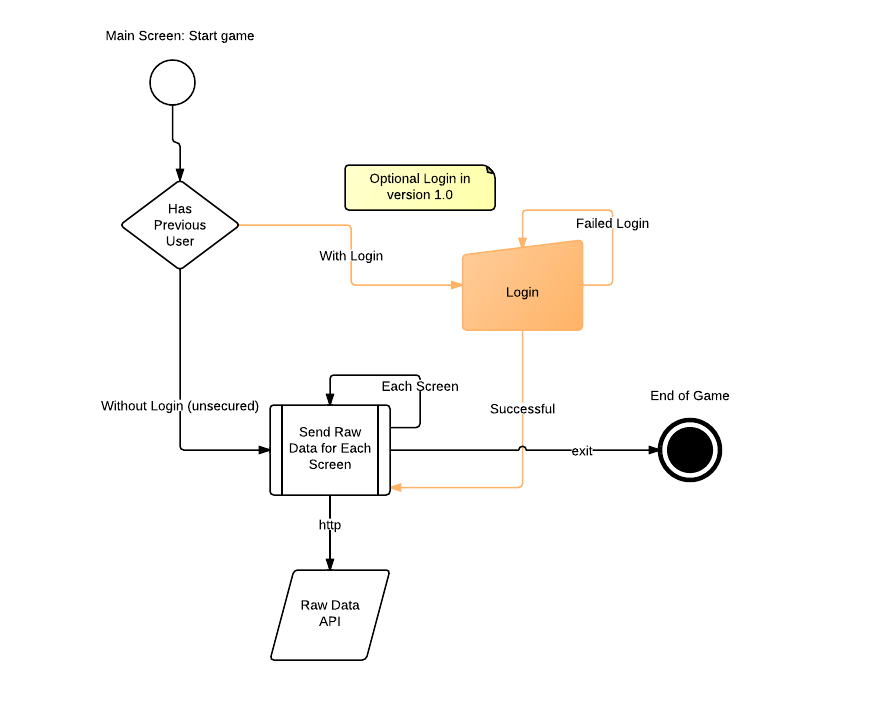
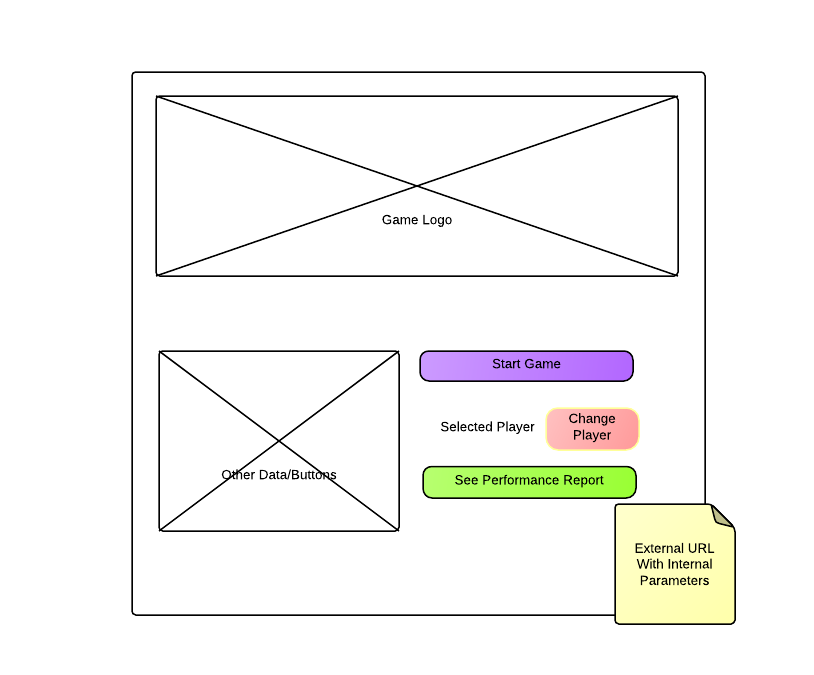

.. Infantium documentation master file, created by
   sphinx-quickstart on Wed Nov 28 12:47:44 2012.
   You can adapt this file completely to your liking, but it should at least
   contain the root `toctree` directive.

Getting Started
=====================================

*********************************************
Requirements
*********************************************

Software::

    HTTP Client
    JSON Encoder/Decoder
    iOS, Android or any gaming framework that supports any of them

You will need granted access with::

    api_username: User name
    api_key: The Secret Key for having access
    gameapp_uuid: The Secret UUID for the app

* **api_username**: Your API username
* **api_key**: Your secret API Key. Don't share it and keep it in a safe place.
* **gameapp_uuid**: Your app identification uuid. Once again, don't share it and keep it safely.

If the game supports several mobile platforms, several gameapp_uuid's will be provided, one for each.

.. warning:: If an improper use of the secret api key or gameapp_uuid is detected, Infantium will remove app access to the platform. If you as developer detects strange behaviour please contact with developers@infantium.com and we'll restore your keys if needed.
.. tip:: You can ask for a Beta Developer user/api doubts/information sending an email to developers@infantium.com

You must follow this quick reference guide or you can go directly (for the impatients) to the :doc:`../api_tutorial`.

*********************************************
Introduction to Integration Process
*********************************************

Game-Tracking platform consists in adapting internal contents from registered developers by sending data to Infantium cloud based service.
This process has several parts that should be performed with specific screens and API methods.

Internal Libraries for each Platform
----------------------------------------------------------------

Infantium doesn't relies on native code in each mobile platform. Although is planned to provide some libraries to facilitate the tracking development, Infantium encourages beta developers to share their tracking code with Infantium so we can Open Source this code as libraries with the correspondant credits to the authors, in order to improve API access for each platform. We strongly beleive in open source and win-win relations!

Behaviour Tracking
----------------------------------------------------------------

Currently version 1.0 only supports external adaptive tracking, so developer use the current navigation developed within app and is developer responsability to track the app behaviour and sending the data to the platform through the API.

*********************************************
Parts of the Integration Process
*********************************************

Main Workflow
----------------------------------------------------------------

All games are multi-player based, and can be potentially multi-user based.

1. **User**: Parent or teacher. A parent/teacher can have multiple players/Students.
2. **Player**: The student/child that actually plays.

Multiplayer is mandatory. Multi-user is optional. If you consider just to have one user, app should store locally user profile info returned by the API and use always this.
While multiayer is simpler and a good way to develop first version, several problems can appear like installing on multiple devices or reinstalling the app.
Infantium will register the user in a web-based mode so an Already registerd button will be provided so a user can link previous data by login through web and will try to merge data, but consider users can misunderstand or skip that and create another profile, so separate data will be created.
We encourage to implement login based workflow, explained later in the doc. This will prevent all these potential problems.

This means a player should be created before start playing. The process is defined as following:

.. tip:: Data Transmission Agreement is optional, it depends on developer to skip. If implemented, game will have to support not tracking gaming.

Screen 1: Create Player
----------------------------------------------------------------

**Create Player**: Screen with a form that includes the following input fields :file:`name`, :file:`age` for years and :file:`months` for months.

The minimum elements it should display are:

.. warning:: This page should navigate directly to Main Screen once player is successfully created. No Screen with Player List required.

Screen 2: Select Player
----------------------------------------------------------------

**Select Player**: Screen with the list of available players. A button for Player Creation must be provided. The basic wireframe for this view is:

.. hint:: The API section that covers the POST method to call for creating player `here <../api_tutorial.html#step-two-get-create-a-player>`_.

.. warning:: The button "Create Player" should navigate to Create Player screen.

Screen 2: Data Transmission Agreement (Optional)
----------------------------------------------------------------

**Data Transmission Agreement**: Screen with the sending data warning and acceptance/information about the service.

The elements it should display are the following:

.. warning:: In both cases (yes and no) this screen navigates to Main Screen. If it user has selected the option "No" the developer should ensure the app will not send any data to server.

Screen 3: Main Screen
----------------------------------------------------------------

This is supposed to be the standard initial screen a game starts with. To integrate with the system it should provide at least these buttons:

* **Player_Name**: Shows the name of the selected player to start the game. Clicking on it should navigate to Screen 2: Select Player.
* **Report Performance**: This button should open an external browser window with the following URL: https://www.infantium.com/profile/dashboard.mobi&userprofile_uuid=UUUU.

.. tip:: The URL parameter userprofile_uuid could only be got from the API. `See complete API workflow to get this value <../api_tutorial.html#the-workflow-send-data-to-the-platform>`_.

Data Transmission Acceptance(Optional) Workflow
----------------------------------------------------------------

The acceptance of transmission of data (Screen 2 in previous sections), should accomplish the following rules:

1. **Acceptance forever**: Once accepted, the app should locally store this information and never been showed again.
2. **Not Acceptance**: If not accepted, game should turn off API calls. BUT the user will be prompted every time he/she creates a user or tries to access the report to accept the Data Transmission Agreement.

.. hint:: While is useful to warn/inform your users about the functionality of reporting this screen is optional and may be not implemented.

Without Data Transmission Acceptance(Optional) Workflow
----------------------------------------------------------------

If you decide to not implement the data acceptance/information, consider that the workflow **only accepts player-mode**, so no **standalone** mode will be accepted. This means, the game cannot be played if no trackinf nor calling the API.

Send Data Within the Game Workflow
----------------------------------------------------------------

The process of sending data to the platform should be performed calling API methods on every screen the Game has.
There are two flows possible:

1. **Login Based**: A model view with login and password should be provided. This will log in a user so multi-user and multi-player

The workflow representing the send data process is:

.. tip:: While you can skip login screen and storing the current user locally,

Open Report URL from Main Screen
----------------------------------------------------------------

The Main Screen must provide now some buttons/links that allow user to have access to Players and the Performance Report.

Performance Report in Infantium 1.x is just an external URL that must be opened by the default browser.
The internal information apart from API username and key that must be supplied is:

* **userprofile_uuid**: Got from Login or Create Player API functions.

* **contentapp_uuid**: Given from the beginning.

URL samples::

   Default Browser Language (Be Careful, preferably the actual app language)
   https://SERVER/mobi/dashboard/auth/?api_username=UUUU&api_key=KKKK&userprofile_uuid=PPPP&contentapp_uuid=GGGG
   Spanish:
   https://SERVER/mobi/dashboard/auth/?app_lang=es&api_username=UUUU&api_key=KKKK&userprofile_uuid=PPPP&contentapp_uuid=GGGG
   English:
   https://SERVER/mobi/dashboard/auth/?app_lang=en&api_username=UUUU&api_key=KKKK&userprofile_uuid=PPPP&contentapp_uuid=GGGG

.. warning:: You should pass api_username, api_key and contentapp_uuid as parameters always, not only the first time you access the report. If not a unauthorized message will be prompted.

.. tip:: Next Step is to see the API methods in detail that are involved in this workflows. See the :doc:`../api_tutorial`.

